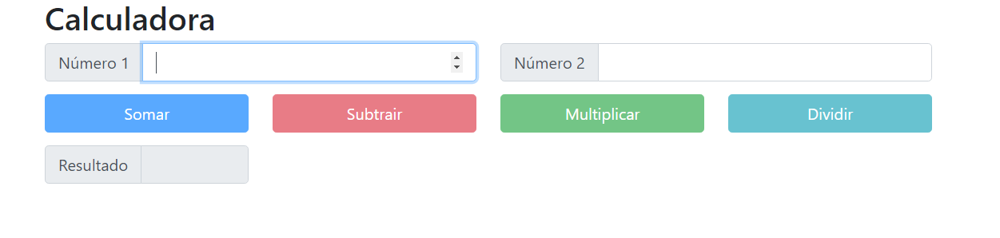

# CalculadoraThreeo
Criação de Api Net Core / FrontEnd Angular

#### Criação da Api com os seguintes metódos

 - Somar
 - Subtrair
 - Multiplicar
 - Dividir
 - Calcular (método que pode ser utilizado para executar qualquer uma das operações acima)
 
 #### Criado frontend com Angular que consome a Api calculadora
 
   - Possui dois que recebem o valor digitado e os boões para execução das operações de acordo com a operação desejada.
 

